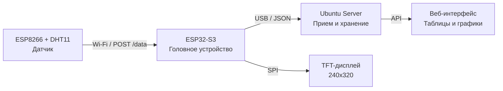

# 🕷️ EnrollaDatos (ED) — Система мониторинга датчиков

Полная система сбора, обработки и визуализации данных с датчиков.

---

## 📋 СОДЕРЖАНИЕ

1. [Архитектура системы](#архитектура-системы)
2. [Компоненты](#компоненты)
3. [Установка и настройка](#установка-и-настройка)
4. [Запуск](#запуск)
5. [Структура данных](#структура-данных)
6. [Управление через веб-интерфейс](#управление-через-веб-интерфейс)
7. [Устранение неполадок](#устранение-неполадок)
8. [План развития](#план-развития)

---

## 🏗️ АРХИТЕКТУРА СИСТЕМЫ

