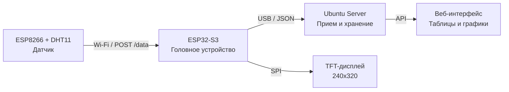

## 🎉 ОТЛИЧНО! ПРОШИВКА ЗАГРУЖЕНА!

Теперь давайте сделаем два важных дела:

1. **Сохраним всё в Git** — чтобы была история и можно было вернуться к рабочей версии
2. **Создадим документацию** — чтобы через месяц вы вспомнили, что и как работает

---

## 📚 ЧАСТЬ 1: СОЗДАНИЕ ДОКУМЕНТАЦИИ

### 📄 Файл `README.md` (в корне проекта)

````markdown
# 🕷️ EnrollaDatos (ED) — Система мониторинга датчиков

Полная система сбора, обработки и визуализации данных с датчиков.

---

## 📋 СОДЕРЖАНИЕ

1. [Архитектура системы](#архитектура-системы)
2. [Компоненты](#компоненты)
3. [Установка и настройка](#установка-и-настройка)
4. [Запуск](#запуск)
5. [Структура данных](#структура-данных)
6. [Управление через веб-интерфейс](#управление-через-веб-интерфейс)
7. [Устранение неполадок](#устранение-неполадок)
8. [План развития](#план-развития)

---

## 🏗️ АРХИТЕКТУРА СИСТЕМЫ


````

**Поток данных:**

1. Датчик (ESP8266) → POST /data → Головное устройство (ESP32-S3)
2. Головное → Буфер → Отправка на сервер (Ubuntu)
3. Сервер → Сохранение в JSON-файл
4. Веб-интерфейс → API → Данные из файла

---

## 🔧 КОМПОНЕНТЫ

### 1. Датчик (ESP8266 + DHT11)

| Параметр              | Значение                        |
| --------------------- | ------------------------------- |
| **Плата**             | NodeMCU v3 (ESP8266)            |
| **Датчик**            | DHT11 (температура + влажность) |
| **Пин DHT11**         | GPIO2 (D4)                      |
| **Сеть**              | `Mechanic` (пароль: `12345678`) |
| **Имя датчика**       | `microclima_1`                  |
| **Интервал отправки** | 10 минут (600000 мс)            |

**Код:** `02_Sensores/01_DHT11_ESP8266/01_DHT11_ESP8266/src/main.cpp`

---

### 2. Головное устройство (ESP32-S3)

| Параметр          | Значение                  |
| ----------------- | ------------------------- |
| **Плата**         | ESP32-S3-DevKitC-1 N16R8  |
| **Дисплей**       | ST7789 240x320 (SPI)      |
| **Пины дисплея**  | CS=10, RST=8, DC=9, BL=48 |
| **Wi-Fi**         | Точка доступа `Mechanic`  |
| **Веб-интерфейс** | `http://192.168.4.1`      |

**Код:** `03_Comunicacion/01_Servidor_Web_AP/src/`

**Функции:**

- ✅ Прием данных от датчиков (POST /register, /data)
- ✅ Отображение на TFT-дисплее
- ✅ Веб-интерфейс для мониторинга
- ✅ Буферизация данных для отправки на сервер

---

### 3. Сервер (Ubuntu 22.04)

| Параметр         | Значение                        |
| ---------------- | ------------------------------- |
| **IP**           | 192.168.3.199                   |
| **Прием данных** | `/dev/ttyACM0`, 115200 бод      |
| **Скрипт**       | `server.py`                     |
| **Автозапуск**   | systemd (enrolla-datos.service) |
| **Данные**       | `~/data/sensor_data.json`       |

**Запуск:**

```bash
cd ~/Proyecto_IoT_Servidor
python3 src/server.py
```

---

## 📂 СТРУКТУРА ПРОЕКТА

```
Proyecto_IoT_ESP32/
├── 00_Documentacion/          # Документация
├── 01_Ejemplos_Basicos/       # Примеры кода
├── 02_Sensores/
│   └── 01_DHT11_ESP8266/      # Прошивка датчика
│       ├── src/
│       │   └── main.cpp
│       └── platformio.ini
├── 03_Comunicacion/
│   └── 01_Servidor_Web_AP/    # Прошивка ESP32-S3
│       ├── src/
│       ├── data/              # Веб-интерфейс
│       └── platformio.ini
├── 04_Control_Motores/        # (будущее)
└── web_ui/                    # Альтернативный веб-интерфейс
```

---

## 🚀 ЗАПУСК СИСТЕМЫ

### 1. Включите ESP32-S3 (головное устройство)

- Подключите питание (USB-C)
- Должен появиться дисплей с интерфейсом
- Создается сеть Wi-Fi `Mechanic`

### 2. Подключите датчик ESP8266

- Включите ESP8266
- Он подключится к сети `Mechanic`
- Начнет отправлять данные каждые 10 минут

### 3. Проверка данных

- **Веб-интерфейс:** `http://192.168.4.1` → увидите датчик
- **Дисплей ESP32:** увидите активные датчики
- **Сервер Ubuntu:** данные сохраняются в `~/data/sensor_data.json`

---

## 🛠️ УСТРАНЕНИЕ НЕПОЛАДОК

### ESP8266 не подключается к Wi-Fi

1. Проверьте, что ESP32-S3 включен и создает сеть `Mechanic`
2. Проверьте пароль (12345678)
3. Перезагрузите ESP8266 (кнопка RST)

### Нет данных на сервере Ubuntu

1. Проверьте подключение USB-кабеля
2. Проверьте, что порт `/dev/ttyACM0` существует
3. Проверьте логи: `sudo journalctl -u enrolla-datos.service -f`
4. Перезапустите сервер: `sudo systemctl restart enrolla-datos.service`

### Веб-интерфейс не открывается

1. Подключитесь к сети `Mechanic`
2. Откройте `http://192.168.4.1`
3. Проверьте, что ESP32-S3 включен

---

## 📈 ПЛАН РАЗВИТИЯ

| Задача                       | Статус  | Приоритет |
| ---------------------------- | ------- | --------- |
| ✅ Базовый сбор данных       | Готово  | -         |
| ✅ Веб-интерфейс на ESP32    | Готово  | -         |
| ✅ Отправка на сервер Ubuntu | Готово  | -         |
| ✅ Автозапуск сервера        | Готово  | -         |
| ⬜ Хранение по датчикам/дням | В плане | Высокий   |
| ⬜ Веб-интерфейс с графиками | В плане | Высокий   |
| ⬜ Мобильное приложение      | В плане | Средний   |
| ⬜ Уведомления (Telegram)    | В плане | Низкий    |

---

## 📝 ИЗМЕНЕНИЕ ИМЕНИ ДАТЧИКА

В файле `src/main.cpp` ESP8266:

```cpp
const char *sensorName = "microclima_1"; // ← Измените на свое имя
```

---

## 🔗 ПОЛЕЗНЫЕ ССЫЛКИ

- [PlatformIO](https://platformio.org/)
- [Adafruit GFX Library](https://github.com/adafruit/Adafruit-GFX-Library)
- [DHT sensor library](https://github.com/adafruit/DHT-sensor-library)

---

**Версия:** v1.0.0
**Дата:** 2026-08-19
**Автор:** EnrollaDatos Team

````

---

## 📁 ЧАСТЬ 2: СОХРАНЕНИЕ В GIT

### 1️⃣ Проверьте статус

```bash
cd ~/Proyecto_IoT_ESP32
git status
````

### 2️⃣ Добавьте все изменения

```bash
git add .
```

### 3️⃣ Сделайте коммит

```bash
git commit -m "v1.0.0: Рабочая версия системы EnrollaDatos

- Добавлена прошивка датчика ESP8266 (microclima_1)
- Головное устройство ESP32-S3 с TFT-дисплеем
- Веб-интерфейс на 192.168.4.1
- Сервер на Ubuntu (автозапуск через systemd)
- Документация в README.md"
```

### 4️⃣ Отправьте на GitHub

```bash
git push origin main
```

---

## 📋 ФАЙЛЫ ДЛЯ ДОКУМЕНТАЦИИ

Создайте также `docs/` с более подробной документацией:

```
00_Documentacion/
├── README.md           # Основная документация (выше)
├── INSTALL.md          # Инструкция по установке
├── TROUBLESHOOTING.md  # Частые проблемы и решения
└── API.md              # Описание API веб-интерфейса
```

---

## ✅ ИТОГ

| Что              | Статус                             |
| ---------------- | ---------------------------------- |
| **Документация** | ✅ Создана (`README.md`)           |
| **Git**          | ✅ Зафиксировано рабочее состояние |
| **Прошивки**     | ✅ Сохранены                       |

---

**Сделайте коммит и напишите, что получилось!** 🕷️📚
